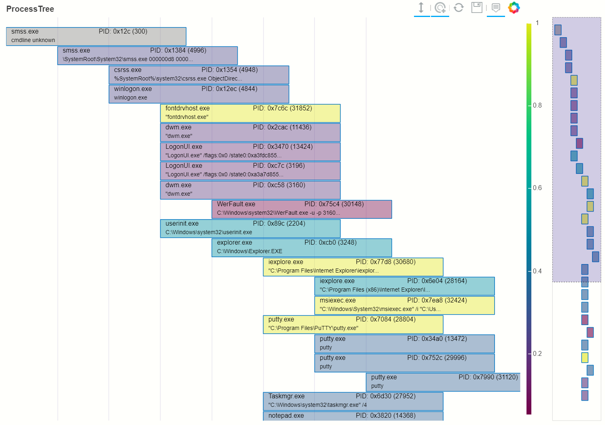
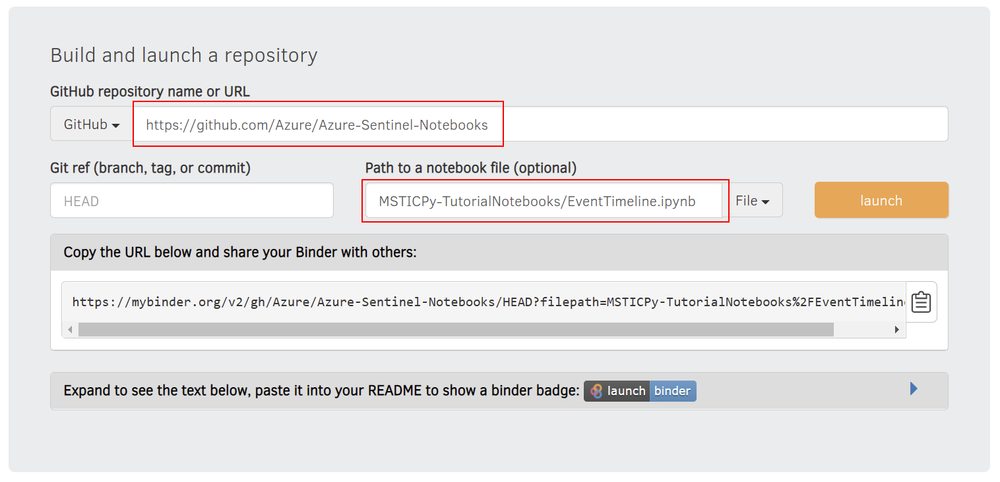

# MSTICPy Tutorial notebooks

This folder contains short notebooks that demonstrate
specific features of MSTICPy such as the process tree, shown below.


<br>
<br>

MSTICPy is the Python package that powers many of the CyberSec notebooks
in Microsoft Sentinel.<br>
You can find out more details and documentation of
these features on the [MSTICPy ReadTheDocs Site](https://msticpy.readthedocs.io).

Many of the notebooks in this folder use local data so don't require a Microsoft Sentinel logon
to run.

---

## Running the notebooks in *Azure Machine Learning*

The simplest way to get these notebooks into your AML workspace is to clone
the GitHub repository into your workspace folders.

You can run the git commands from an existing notebook or from a terminal on your
AML compute.

To clone the repo into a local "azure-sentinel-nb" folder (you can specify whatever
name you prefer) type the following in a notebook cell and run

```python
!git clone https://github.com/Azure/Azure-Sentinel-Notebooks.git azure-sentinel-nb
```

The command is the same if you are running in a shell, except you omit the leading "!"

```bash
$ git clone https://github.com/Azure/Azure-Sentinel-Notebooks.git azure-sentinel-nb
```

This will create a copy of the GitHub repo contents in the "azure-sentinel-nb" folder
of your user folder. You will find the tutorial notebooks in the MSTIC-TutorialNotebooks
sub folder.

To update your copy of the notebooks, type the following into a notebook cell and run:

```python
!cd azure-sentinel-nb && git pull
```

Or from the terminal:

```bash
$ cd azure-sentinel-nb && git pull
```

If you have modified any of the notebooks, the pull command will fail.<br>
To reset use
`git reset --hard` (copy any modified files from the folder before running this).

---

## Running the notebooks in *mybinder*

You can run these notebooks in mybinder.org. This is a free notebook execution
environment available to the community.

> **Note:** mybinder.org is a community resource. Please use it responsibly<br>
> so that it remains available for others. 

1. Select the notebook that you want to run.
2. Go to https://mybinder.org
3. Fill the GitHub repository name ("https://github.com/Azure/Azure-Sentinel-Notebooks")
   and the notebook name (prefix with the path "MSTICPy-TutorialNotebooks/" as shown below).
4. Click the **launch** button

