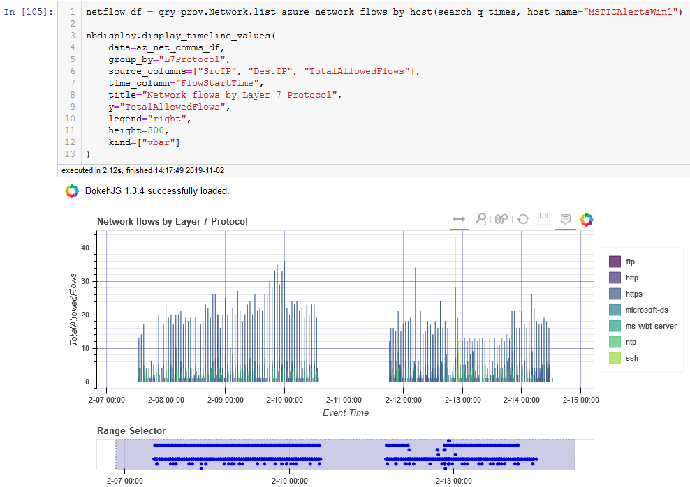

# Microsoft Sentinel Notebooks

Jupyter notebooks are an interactive development and data analysis
environment hosted in a browser. The open API supported by Microsoft Sentinel
allows you to use Jupyter notebooks to query, transform, analyze
and visualize Microsoft Sentinel data. This makes notebooks a powerful
addition to Microsoft Sentinel and is especially well-suited to ad-hoc
investigations, hunting or customized workflows.

More information on getting started with
[Microsoft Sentinel and Azure Notebooks](https://docs.microsoft.com/azure/sentinel/notebooks)

This repository contains notebooks contributed by Microsoft and the community
to assist hunting and investigation tasks in Microsoft Sentinel.

---

# Finding a notebook in the repo

## Top Level notebooks

There are several notebooks at the top level of the repo - eventually only a few introductory notebooks will reside here. For the moment, notebooks at the top level include all of those used in the Microsoft Sentinel portal.

If you have never used notebooks in Microsoft Sentinel before you should run through the [Getting Started Notebook](https://nbviewer.jupyter.org/github/Azure/Azure-Sentinel-Notebooks/blob/master/A%20Getting%20Started%20Guide%20For%20Azure%20Sentinel%20ML%20Notebooks.ipynb)

## Other Folders

<h4><a href="./scenario-notebooks">scenario-notebooks</a></h4>

This contains notebooks designed for use by you in Microsoft Sentinel.
Some of these are intended to illustrate specific techniques or investigation
approaches

<h4><a href="./tutorial-and-examples">tutorials-and-examples</a></h4>

- [example-notebooks](./example-notebooks) Examples of techniques or features
- [feature-tutorials](./feature-tutorials) MSTICPy feature tutorial notebooks
- [how-tos](./how-tos) Articles and notebooks illustrating specific techniques
- [other-language-kernels](./other-language-kernels) Notebooks using alternative kernels
- [training-notebooks](./training-notebooks) Notebooks used in training webinars
- [deprecated-notebooks](./deprecated-notebooks) Older, deprecated notebooks

There are also support folders - source and utils

---

# Full list of notebooks

    
<table class=nb_table>
<tr><th class=width-nb>Notebook</th><th class=width-f>Folder</th></tr>
<tr><td><a href='https://github.com/Azure/Azure-Sentinel-Notebooks/blob/master/A%20Getting%20Started%20Guide%20For%20Azure%20Sentinel%20ML%20Notebooks.ipynb'>A Getting Started Guide For Azure Sentinel ML Notebooks.ipynb</a></td><td class=width-f></td>
<tr><td><a href='https://github.com/Azure/Azure-Sentinel-Notebooks/blob/master/A%20Getting%20Started%20Guide%20For%20PowerShell%20AML%20Notebooks.ipynb'>A Getting Started Guide For PowerShell AML Notebooks.ipynb</a></td><td class=width-f></td>
<tr><td><a href='https://github.com/Azure/Azure-Sentinel-Notebooks/blob/master/A%20Tour%20of%20Cybersec%20notebook%20features.ipynb'>A Tour of Cybersec notebook features.ipynb</a></td><td class=width-f></td>
<tr><td><a href='https://github.com/Azure/Azure-Sentinel-Notebooks/blob/master/ConfiguringNotebookEnvironment.ipynb'>ConfiguringNotebookEnvironment.ipynb</a></td><td class=width-f></td>
<tr><td><a href='https://github.com/Azure/Azure-Sentinel-Notebooks/blob/master/Credential%20Scan%20on%20Azure%20Blob%20Storage.ipynb'>Credential Scan on Azure Blob Storage.ipynb</a></td><td class=width-f></td>
<tr><td><a href='https://github.com/Azure/Azure-Sentinel-Notebooks/blob/master/Credential%20Scan%20on%20Azure%20Data%20Explorer.ipynb'>Credential Scan on Azure Data Explorer.ipynb</a></td><td class=width-f></td>
<tr><td><a href='https://github.com/Azure/Azure-Sentinel-Notebooks/blob/master/Credential%20Scan%20on%20Azure%20Log%20Analytics.ipynb'>Credential Scan on Azure Log Analytics.ipynb</a></td><td class=width-f></td>
<tr><td><a href='https://github.com/Azure/Azure-Sentinel-Notebooks/blob/master/Entity%20Explorer%20-%20Account.ipynb'>Entity Explorer - Account.ipynb</a></td><td class=width-f></td>
<tr><td><a href='https://github.com/Azure/Azure-Sentinel-Notebooks/blob/master/Entity%20Explorer%20-%20Domain%20and%20URL.ipynb'>Entity Explorer - Domain and URL.ipynb</a></td><td class=width-f></td>
<tr><td><a href='https://github.com/Azure/Azure-Sentinel-Notebooks/blob/master/Entity%20Explorer%20-%20IP%20Address.ipynb'>Entity Explorer - IP Address.ipynb</a></td><td class=width-f></td>
<tr><td><a href='https://github.com/Azure/Azure-Sentinel-Notebooks/blob/master/Entity%20Explorer%20-%20Linux%20Host.ipynb'>Entity Explorer - Linux Host.ipynb</a></td><td class=width-f></td>
<tr><td><a href='https://github.com/Azure/Azure-Sentinel-Notebooks/blob/master/Entity%20Explorer%20-%20Windows%20Host.ipynb'>Entity Explorer - Windows Host.ipynb</a></td><td class=width-f></td>
<tr><td><a href='https://github.com/Azure/Azure-Sentinel-Notebooks/blob/master/Guided%20Hunting%20-%20Anomalous%20Office365%20Exchange%20Sessions.ipynb'>Guided Hunting - Anomalous Office365 Exchange Sessions.ipynb</a></td><td class=width-f></td>
<tr><td><a href='https://github.com/Azure/Azure-Sentinel-Notebooks/blob/master/Guided%20Hunting%20-%20Azure%20Resource%20Explorer.ipynb'>Guided Hunting - Azure Resource Explorer.ipynb</a></td><td class=width-f></td>
<tr><td><a href='https://github.com/Azure/Azure-Sentinel-Notebooks/blob/master/Guided%20Hunting%20-%20Base64-Encoded%20Linux%20Commands.ipynb'>Guided Hunting - Base64-Encoded Linux Commands.ipynb</a></td><td class=width-f></td>
<tr><td><a href='https://github.com/Azure/Azure-Sentinel-Notebooks/blob/master/Guided%20Hunting%20-%20Covid-19%20Themed%20Threats.ipynb'>Guided Hunting - Covid-19 Themed Threats.ipynb</a></td><td class=width-f></td>
<tr><td><a href='https://github.com/Azure/Azure-Sentinel-Notebooks/blob/master/Guided%20Investigation%20-%20Anomaly%20Lookup.ipynb'>Guided Investigation - Anomaly Lookup.ipynb</a></td><td class=width-f></td>
<tr><td><a href='https://github.com/Azure/Azure-Sentinel-Notebooks/blob/master/Guided%20Investigation%20-%20Incident%20Triage.ipynb'>Guided Investigation - Incident Triage.ipynb</a></td><td class=width-f></td>
<tr><td><a href='https://github.com/Azure/Azure-Sentinel-Notebooks/blob/master/Guided%20Investigation%20-%20Process-Alerts.ipynb'>Guided Investigation - Process-Alerts.ipynb</a></td><td class=width-f></td>
<tr><td><a href='https://github.com/Azure/Azure-Sentinel-Notebooks/blob/master/Guided%20Investigation%20-%20Solarwinds%20Post%20Compromise%20Activity.ipynb'>Guided Investigation - Solarwinds Post Compromise Activity.ipynb</a></td><td class=width-f></td>
<tr><td><a href='https://github.com/Azure/Azure-Sentinel-Notebooks/blob/master/Guided%20Triage%20-%20Alerts.ipynb'>Guided Triage - Alerts.ipynb</a></td><td class=width-f></td>
<tr><td><a href='https://github.com/Azure/Azure-Sentinel-Notebooks/blob/master/Hands-on%201.%20Data%20Discovery%20using%20Azure%20REST%20API.ipynb'>Hands-on 1. Data Discovery using Azure REST API.ipynb</a></td><td class=width-f></td>
<tr><td><a href='https://github.com/Azure/Azure-Sentinel-Notebooks/blob/master/Hands-on%202.%20Surfing%20Data%20using%20Azure%20SDK.ipynb'>Hands-on 2. Surfing Data using Azure SDK.ipynb</a></td><td class=width-f></td>
<tr><td><a href='https://github.com/Azure/Azure-Sentinel-Notebooks/blob/master/Machine%20Learning%20in%20Notebooks%20Examples.ipynb'>Machine Learning in Notebooks Examples.ipynb</a></td><td class=width-f></td>
<tr><td><a href='https://github.com/Azure/Azure-Sentinel-Notebooks/blob/master/scenario-notebooks/AffectedKeyCredentials-CVE-2021-42306.ipynb'>AffectedKeyCredentials-CVE-2021-42306.ipynb</a></td><td class=width-f>scenario-notebooks</td>
<tr><td><a href='https://github.com/Azure/Azure-Sentinel-Notebooks/blob/master/scenario-notebooks/AutomatedNotebooks-IncidentTriage.ipynb'>AutomatedNotebooks-IncidentTriage.ipynb</a></td><td class=width-f>scenario-notebooks</td>
<tr><td><a href='https://github.com/Azure/Azure-Sentinel-Notebooks/blob/master/scenario-notebooks/AutomatedNotebooks-Manager.ipynb'>AutomatedNotebooks-Manager.ipynb</a></td><td class=width-f>scenario-notebooks</td>
<tr><td><a href='https://github.com/Azure/Azure-Sentinel-Notebooks/blob/master/scenario-notebooks/Guided%20Hunting%20-%20Detect%20potential%20network%20beaconing%20using%20Apache%20Spark%20via%20Azure%20Synapse.ipynb'>Guided Hunting - Detect potential network beaconing using Apache Spark via Azure Synapse.ipynb</a></td><td class=width-f>scenario-notebooks</td>
<tr><td><a href='https://github.com/Azure/Azure-Sentinel-Notebooks/blob/master/scenario-notebooks/Guided%20Hunting%20-%20Office365-Exploring.ipynb'>Guided Hunting - Office365-Exploring.ipynb</a></td><td class=width-f>scenario-notebooks</td>
<tr><td><a href='https://github.com/Azure/Azure-Sentinel-Notebooks/blob/master/scenario-notebooks/Guided%20Investigation%20-%20MDE%20Webshell%20Alerts.ipynb'>Guided Investigation - MDE Webshell Alerts.ipynb</a></td><td class=width-f>scenario-notebooks</td>
<tr><td><a href='https://github.com/Azure/Azure-Sentinel-Notebooks/blob/master/scenario-notebooks/Guided%20Investigation%20-%20WAF%20data.ipynb'>Guided Investigation - WAF data.ipynb</a></td><td class=width-f>scenario-notebooks</td>
<tr><td><a href='https://github.com/Azure/Azure-Sentinel-Notebooks/blob/master/scenario-notebooks/UserSecurityMetadata/Guided%20Analysis%20-%20User%20Security%20Metadata.ipynb'>Guided Analysis - User Security Metadata.ipynb</a></td><td class=width-f>scenario-notebooks/UserSecurityMetadata</td>
<tr><td><a href='https://github.com/Azure/Azure-Sentinel-Notebooks/blob/master/src/Test/papermill_test_runner.ipynb'>papermill_test_runner.ipynb</a></td><td class=width-f>src/Test</td>
<tr><td><a href='https://github.com/Azure/Azure-Sentinel-Notebooks/blob/master/tutorials-and-examples/example-notebooks/Example%20-%20Azure%20Storage%20VT%20Hash%20Lookup.ipynb'>Example - Azure Storage VT Hash Lookup.ipynb</a></td><td class=width-f>tutorials-and-examples/example-notebooks</td>
<tr><td><a href='https://github.com/Azure/Azure-Sentinel-Notebooks/blob/master/tutorials-and-examples/example-notebooks/Example%20-%20Guided%20Hunting%20-%20Office365-Exploring.ipynb'>Example - Guided Hunting - Office365-Exploring.ipynb</a></td><td class=width-f>tutorials-and-examples/example-notebooks</td>
<tr><td><a href='https://github.com/Azure/Azure-Sentinel-Notebooks/blob/master/tutorials-and-examples/example-notebooks/Example%20-%20Guided%20Investigation%20-%20Process-Alerts.ipynb'>Example - Guided Investigation - Process-Alerts.ipynb</a></td><td class=width-f>tutorials-and-examples/example-notebooks</td>
<tr><td><a href='https://github.com/Azure/Azure-Sentinel-Notebooks/blob/master/tutorials-and-examples/example-notebooks/M365%20Defender%20-%20APIs%20ep3.ipynb'>M365 Defender - APIs ep3.ipynb</a></td><td class=width-f>tutorials-and-examples/example-notebooks</td>
<tr><td><a href='https://github.com/Azure/Azure-Sentinel-Notebooks/blob/master/tutorials-and-examples/example-notebooks/M365%20Defender%20-%20hunting.ipynb'>M365 Defender - hunting.ipynb</a></td><td class=width-f>tutorials-and-examples/example-notebooks</td>
<tr><td><a href='https://github.com/Azure/Azure-Sentinel-Notebooks/blob/master/tutorials-and-examples/example-notebooks/MDE%20APIs%20Demo%20Notebook.ipynb'>MDE APIs Demo Notebook.ipynb</a></td><td class=width-f>tutorials-and-examples/example-notebooks</td>
<tr><td><a href='https://github.com/Azure/Azure-Sentinel-Notebooks/blob/master/tutorials-and-examples/example-notebooks/MSTICPy%20Tour.ipynb'>MSTICPy Tour.ipynb</a></td><td class=width-f>tutorials-and-examples/example-notebooks</td>
<tr><td><a href='https://github.com/Azure/Azure-Sentinel-Notebooks/blob/master/tutorials-and-examples/example-notebooks/Senserva%20Connections%20Graph%20Notebook.ipynb'>Senserva Connections Graph Notebook.ipynb</a></td><td class=width-f>tutorials-and-examples/example-notebooks</td>
<tr><td><a href='https://github.com/Azure/Azure-Sentinel-Notebooks/blob/master/tutorials-and-examples/example-notebooks/SigmaRuleImporter.ipynb'>SigmaRuleImporter.ipynb</a></td><td class=width-f>tutorials-and-examples/example-notebooks</td>
<tr><td><a href='https://github.com/Azure/Azure-Sentinel-Notebooks/blob/master/tutorials-and-examples/example-notebooks/VirusTotal%20File%20Behavior%20Explorer%20-%20MS%20and%20Sysmon%20detonation.ipynb'>VirusTotal File Behavior Explorer - MS and Sysmon detonation.ipynb</a></td><td class=width-f>tutorials-and-examples/example-notebooks</td>
<tr><td><a href='https://github.com/Azure/Azure-Sentinel-Notebooks/blob/master/tutorials-and-examples/example-notebooks/msticpy%20demo.ipynb'>msticpy demo.ipynb</a></td><td class=width-f>tutorials-and-examples/example-notebooks</td>
<tr><td><a href='https://github.com/Azure/Azure-Sentinel-Notebooks/blob/master/tutorials-and-examples/feature-tutorials/AnomalousSequence.ipynb'>AnomalousSequence.ipynb</a></td><td class=width-f>tutorials-and-examples/feature-tutorials</td>
<tr><td><a href='https://github.com/Azure/Azure-Sentinel-Notebooks/blob/master/tutorials-and-examples/feature-tutorials/AzureBlobStorage.ipynb'>AzureBlobStorage.ipynb</a></td><td class=width-f>tutorials-and-examples/feature-tutorials</td>
<tr><td><a href='https://github.com/Azure/Azure-Sentinel-Notebooks/blob/master/tutorials-and-examples/feature-tutorials/AzureSentinelAPIs.ipynb'>AzureSentinelAPIs.ipynb</a></td><td class=width-f>tutorials-and-examples/feature-tutorials</td>
<tr><td><a href='https://github.com/Azure/Azure-Sentinel-Notebooks/blob/master/tutorials-and-examples/feature-tutorials/Base64Unpack.ipynb'>Base64Unpack.ipynb</a></td><td class=width-f>tutorials-and-examples/feature-tutorials</td>
<tr><td><a href='https://github.com/Azure/Azure-Sentinel-Notebooks/blob/master/tutorials-and-examples/feature-tutorials/DataObfuscation.ipynb'>DataObfuscation.ipynb</a></td><td class=width-f>tutorials-and-examples/feature-tutorials</td>
<tr><td><a href='https://github.com/Azure/Azure-Sentinel-Notebooks/blob/master/tutorials-and-examples/feature-tutorials/DataUploader.ipynb'>DataUploader.ipynb</a></td><td class=width-f>tutorials-and-examples/feature-tutorials</td>
<tr><td><a href='https://github.com/Azure/Azure-Sentinel-Notebooks/blob/master/tutorials-and-examples/feature-tutorials/DataViewer.ipynb'>DataViewer.ipynb</a></td><td class=width-f>tutorials-and-examples/feature-tutorials</td>
<tr><td><a href='https://github.com/Azure/Azure-Sentinel-Notebooks/blob/master/tutorials-and-examples/feature-tutorials/Data_Queries.ipynb'>Data_Queries.ipynb</a></td><td class=width-f>tutorials-and-examples/feature-tutorials</td>
<tr><td><a href='https://github.com/Azure/Azure-Sentinel-Notebooks/blob/master/tutorials-and-examples/feature-tutorials/EventClustering.ipynb'>EventClustering.ipynb</a></td><td class=width-f>tutorials-and-examples/feature-tutorials</td>
<tr><td><a href='https://github.com/Azure/Azure-Sentinel-Notebooks/blob/master/tutorials-and-examples/feature-tutorials/EventTimeline.ipynb'>EventTimeline.ipynb</a></td><td class=width-f>tutorials-and-examples/feature-tutorials</td>
<tr><td><a href='https://github.com/Azure/Azure-Sentinel-Notebooks/blob/master/tutorials-and-examples/feature-tutorials/FoliumMap.ipynb'>FoliumMap.ipynb</a></td><td class=width-f>tutorials-and-examples/feature-tutorials</td>
<tr><td><a href='https://github.com/Azure/Azure-Sentinel-Notebooks/blob/master/tutorials-and-examples/feature-tutorials/GeoIPLookups.ipynb'>GeoIPLookups.ipynb</a></td><td class=width-f>tutorials-and-examples/feature-tutorials</td>
<tr><td><a href='https://github.com/Azure/Azure-Sentinel-Notebooks/blob/master/tutorials-and-examples/feature-tutorials/IoCExtract.ipynb'>IoCExtract.ipynb</a></td><td class=width-f>tutorials-and-examples/feature-tutorials</td>
<tr><td><a href='https://github.com/Azure/Azure-Sentinel-Notebooks/blob/master/tutorials-and-examples/feature-tutorials/MDATPQuery.ipynb'>MDATPQuery.ipynb</a></td><td class=width-f>tutorials-and-examples/feature-tutorials</td>
<tr><td><a href='https://github.com/Azure/Azure-Sentinel-Notebooks/blob/master/tutorials-and-examples/feature-tutorials/MPSettingsEditor.ipynb'>MPSettingsEditor.ipynb</a></td><td class=width-f>tutorials-and-examples/feature-tutorials</td>
<tr><td><a href='https://github.com/Azure/Azure-Sentinel-Notebooks/blob/master/tutorials-and-examples/feature-tutorials/MordorData.ipynb'>MordorData.ipynb</a></td><td class=width-f>tutorials-and-examples/feature-tutorials</td>
<tr><td><a href='https://github.com/Azure/Azure-Sentinel-Notebooks/blob/master/tutorials-and-examples/feature-tutorials/NotebookWidgets.ipynb'>NotebookWidgets.ipynb</a></td><td class=width-f>tutorials-and-examples/feature-tutorials</td>
<tr><td><a href='https://github.com/Azure/Azure-Sentinel-Notebooks/blob/master/tutorials-and-examples/feature-tutorials/PivotFunctions-Introduction.ipynb'>PivotFunctions-Introduction.ipynb</a></td><td class=width-f>tutorials-and-examples/feature-tutorials</td>
<tr><td><a href='https://github.com/Azure/Azure-Sentinel-Notebooks/blob/master/tutorials-and-examples/feature-tutorials/PivotFunctions.ipynb'>PivotFunctions.ipynb</a></td><td class=width-f>tutorials-and-examples/feature-tutorials</td>
<tr><td><a href='https://github.com/Azure/Azure-Sentinel-Notebooks/blob/master/tutorials-and-examples/feature-tutorials/ProcessTree.ipynb'>ProcessTree.ipynb</a></td><td class=width-f>tutorials-and-examples/feature-tutorials</td>
<tr><td><a href='https://github.com/Azure/Azure-Sentinel-Notebooks/blob/master/tutorials-and-examples/feature-tutorials/ResourceGraphDriver.ipynb'>ResourceGraphDriver.ipynb</a></td><td class=width-f>tutorials-and-examples/feature-tutorials</td>
<tr><td><a href='https://github.com/Azure/Azure-Sentinel-Notebooks/blob/master/tutorials-and-examples/feature-tutorials/Splunk-DataConnector.ipynb'>Splunk-DataConnector.ipynb</a></td><td class=width-f>tutorials-and-examples/feature-tutorials</td>
<tr><td><a href='https://github.com/Azure/Azure-Sentinel-Notebooks/blob/master/tutorials-and-examples/feature-tutorials/SqlToKql.ipynb'>SqlToKql.ipynb</a></td><td class=width-f>tutorials-and-examples/feature-tutorials</td>
<tr><td><a href='https://github.com/Azure/Azure-Sentinel-Notebooks/blob/master/tutorials-and-examples/feature-tutorials/Sumologic-DataConnector.ipynb'>Sumologic-DataConnector.ipynb</a></td><td class=width-f>tutorials-and-examples/feature-tutorials</td>
<tr><td><a href='https://github.com/Azure/Azure-Sentinel-Notebooks/blob/master/tutorials-and-examples/feature-tutorials/TIProviders.ipynb'>TIProviders.ipynb</a></td><td class=width-f>tutorials-and-examples/feature-tutorials</td>
<tr><td><a href='https://github.com/Azure/Azure-Sentinel-Notebooks/blob/master/tutorials-and-examples/feature-tutorials/TimeSeriesAnomaliesVisualization.ipynb'>TimeSeriesAnomaliesVisualization.ipynb</a></td><td class=width-f>tutorials-and-examples/feature-tutorials</td>
<tr><td><a href='https://github.com/Azure/Azure-Sentinel-Notebooks/blob/master/tutorials-and-examples/feature-tutorials/VTLookupV3.ipynb'>VTLookupV3.ipynb</a></td><td class=width-f>tutorials-and-examples/feature-tutorials</td>
<tr><td><a href='https://github.com/Azure/Azure-Sentinel-Notebooks/blob/master/tutorials-and-examples/feature-tutorials/VirusTotalLookup.ipynb'>VirusTotalLookup.ipynb</a></td><td class=width-f>tutorials-and-examples/feature-tutorials</td>
<tr><td><a href='https://github.com/Azure/Azure-Sentinel-Notebooks/blob/master/tutorials-and-examples/how-tos/Adding%20Hunting%20Bookmarks.ipynb'>Adding Hunting Bookmarks.ipynb</a></td><td class=width-f>tutorials-and-examples/how-tos</td>
<tr><td><a href='https://github.com/Azure/Azure-Sentinel-Notebooks/blob/master/tutorials-and-examples/how-tos/Adding%20Secrets%20to%20Azure%20Key%20Vault.ipynb'>Adding Secrets to Azure Key Vault.ipynb</a></td><td class=width-f>tutorials-and-examples/how-tos</td>
<tr><td><a href='https://github.com/Azure/Azure-Sentinel-Notebooks/blob/master/tutorials-and-examples/how-tos/Automation%20Gallery%20-%20Credential%20Scan%20on%20Azure%20Blob%20Storage.ipynb'>Automation Gallery - Credential Scan on Azure Blob Storage.ipynb</a></td><td class=width-f>tutorials-and-examples/how-tos</td>
<tr><td><a href='https://github.com/Azure/Azure-Sentinel-Notebooks/blob/master/tutorials-and-examples/how-tos/Automation%20Setup%20-%20Configure%20Azure%20Machine%20Learning%20Compute%20Cluster%20and%20Managed%20Identity.ipynb'>Automation Setup - Configure Azure Machine Learning Compute Cluster and Managed Identity.ipynb</a></td><td class=width-f>tutorials-and-examples/how-tos</td>
<tr><td><a href='https://github.com/Azure/Azure-Sentinel-Notebooks/blob/master/tutorials-and-examples/how-tos/Automation%20Setup%20-%20Configure%20Azure%20Machine%20Learning%20Pipelines.ipynb'>Automation Setup - Configure Azure Machine Learning Pipelines.ipynb</a></td><td class=width-f>tutorials-and-examples/how-tos</td>
<tr><td><a href='https://github.com/Azure/Azure-Sentinel-Notebooks/blob/master/tutorials-and-examples/how-tos/Azure%20Sentinel%20Query%20Creator.ipynb'>Azure Sentinel Query Creator.ipynb</a></td><td class=width-f>tutorials-and-examples/how-tos</td>
<tr><td><a href='https://github.com/Azure/Azure-Sentinel-Notebooks/blob/master/tutorials-and-examples/how-tos/Configurate%20Azure%20ML%20and%20Azure%20Synapse%20Analytics.ipynb'>Configurate Azure ML and Azure Synapse Analytics.ipynb</a></td><td class=width-f>tutorials-and-examples/how-tos</td>
<tr><td><a href='https://github.com/Azure/Azure-Sentinel-Notebooks/blob/master/tutorials-and-examples/how-tos/Notebook%20Template.ipynb'>Notebook Template.ipynb</a></td><td class=width-f>tutorials-and-examples/how-tos</td>
<tr><td><a href='https://github.com/Azure/Azure-Sentinel-Notebooks/blob/master/tutorials-and-examples/how-tos/Provisioning%20DSVM.ipynb'>Provisioning DSVM.ipynb</a></td><td class=width-f>tutorials-and-examples/how-tos</td>
<tr><td><a href='https://github.com/Azure/Azure-Sentinel-Notebooks/blob/master/tutorials-and-examples/how-tos/TroubleShootingNotebooks.ipynb'>TroubleShootingNotebooks.ipynb</a></td><td class=width-f>tutorials-and-examples/how-tos</td>
<tr><td><a href='https://github.com/Azure/Azure-Sentinel-Notebooks/blob/master/tutorials-and-examples/other-language-kernels/A%20Getting%20Started%20Guide%20For%20CSharp%20AML%20Notebooks.ipynb'>A Getting Started Guide For CSharp AML Notebooks.ipynb</a></td><td class=width-f>tutorials-and-examples/other-language-kernels</td>
<tr><td><a href='https://github.com/Azure/Azure-Sentinel-Notebooks/blob/master/tutorials-and-examples/training-notebooks/A%20Python%20Crash%20Course%20-%20Part%201%20-%20Fundamentals.ipynb'>A Python Crash Course - Part 1 - Fundamentals.ipynb</a></td><td class=width-f>tutorials-and-examples/training-notebooks</td>
<tr><td><a href='https://github.com/Azure/Azure-Sentinel-Notebooks/blob/master/tutorials-and-examples/training-notebooks/Training%20-%20MSTICPy%20Training%201221.ipynb'>Training - MSTICPy Training 1221.ipynb</a></td><td class=width-f>tutorials-and-examples/training-notebooks</td>
<tr><td><a href='https://github.com/Azure/Azure-Sentinel-Notebooks/blob/master/tutorials-and-examples/training-notebooks/Training%20-%20MSTICPy%20Training%203%20-%202022-01-13.ipynb'>Training - MSTICPy Training 3 - 2022-01-13.ipynb</a></td><td class=width-f>tutorials-and-examples/training-notebooks</td>
<tr><td><a href='https://github.com/Azure/Azure-Sentinel-Notebooks/blob/master/utils/generate-nb-toc.ipynb'>generate-nb-toc.ipynb</a></td><td class=width-f>utils</td>
<tr><td><a href='https://github.com/Azure/Azure-Sentinel-Notebooks/blob/master/tutorials-and-examples/deprecated-notebooks/A%20Getting%20Started%20Guide%20For%20Azure%20Sentinel%20Notebooks.ipynb'>A Getting Started Guide For Azure Sentinel Notebooks.ipynb</a></td><td class=width-f>tutorials-and-examples/deprecated-notebooks</td>
<tr><td><a href='https://github.com/Azure/Azure-Sentinel-Notebooks/blob/master/tutorials-and-examples/deprecated-notebooks/Example%20-%20Step-by-Step%20Linux-Windows-Office%20Investigation.ipynb'>Example - Step-by-Step Linux-Windows-Office Investigation.ipynb</a></td><td class=width-f>tutorials-and-examples/deprecated-notebooks</td>
<tr><td><a href='https://github.com/Azure/Azure-Sentinel-Notebooks/blob/master/tutorials-and-examples/deprecated-notebooks/Get%20Started.ipynb'>Get Started.ipynb</a></td><td class=width-f>tutorials-and-examples/deprecated-notebooks</td>
</table>

---

# Viewing the notebooks

You can view any of the notebooks directly on GitHub just by clicking on them.

For higher fidelity rendering we'd recommend Jupyter nbviewer.

- Open a notebook here and copy the URL (or copy the a link from the table above)
- Go to [https://nbviewer.jupyter.org/](https://nbviewer.jupyter.org/) and paste the URL into the location text box.
- Hit the Go! button

---

# Find help and troubleshooting articles in the Wiki

[Sentinel Notebooks Wiki](https://github.com/Azure/Azure-Sentinel-Notebooks/wiki)

---

# More Information

- [Getting Started](https://nbviewer.jupyter.org/github/Azure/Azure-Sentinel-Notebooks/blob/master/A%20Getting%20Started%20Guide%20For%20Azure%20Sentinel%20ML%20Notebooks.ipynb)
  notebook.
- [Configuring notebook environment](https://nbviewer.jupyter.org/github/Azure/Azure-Sentinel-Notebooks/blob/master/ConfiguringNotebookEnvironment.ipynb)
  notebook.
- Run a demonstration notebook in 
- Read more about the use of Jupyter notebooks in Microsoft Sentinel on the
  [Microsoft Sentinel Technical Community blog](https://techcommunity.microsoft.com/t5/azure-sentinel/bg-p/AzureSentinelBlog/label-name/Notebooks).
- Read more about the [Azure ML Notebooks Service](https://docs.microsoft.com/azure/machine-learning/how-to-run-jupyter-notebooks).
- Read more about [MSTICPy](https://msticpy.readthedocs.io) - the CyberSecurity Python library that powers most of the notebooks

---

# Feedback

For questions or feedback, please file an issue or contact [asinotebooks@service.microsoft.com](mailto:asinotebooks@service.microsoft.com)

---

# Contributing

This project welcomes contributions and suggestions.  Most contributions require you to agree to a
Contributor License Agreement (CLA) declaring that you have the right to, and actually do, grant us
the rights to use your contribution. For details, visit https://cla.opensource.microsoft.com.

When you submit a pull request, a CLA bot will automatically determine whether you need to provide
a CLA and decorate the PR appropriately (e.g., status check, comment). Simply follow the instructions
provided by the bot. You will only need to do this once across all repos using our CLA.

This project has adopted the [Microsoft Open Source Code of Conduct](https://opensource.microsoft.com/codeofconduct/).
For more information see the [Code of Conduct FAQ](https://opensource.microsoft.com/codeofconduct/faq/) or
contact [opencode@microsoft.com](mailto:opencode@microsoft.com) with any additional questions or comments.
