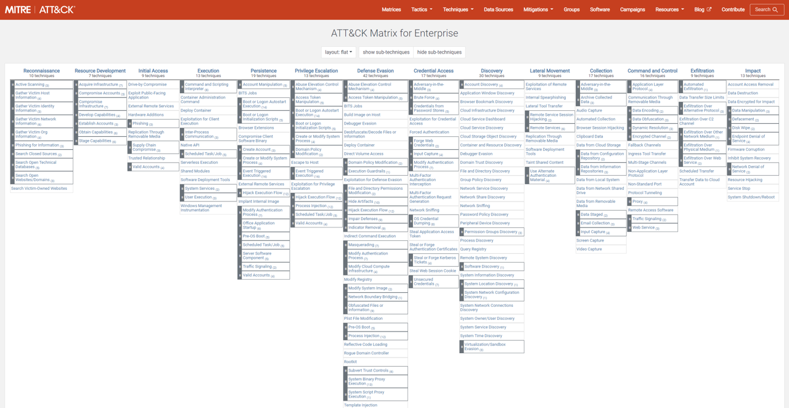
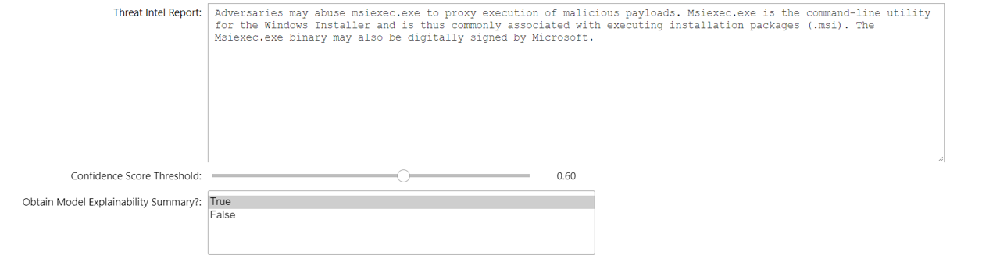
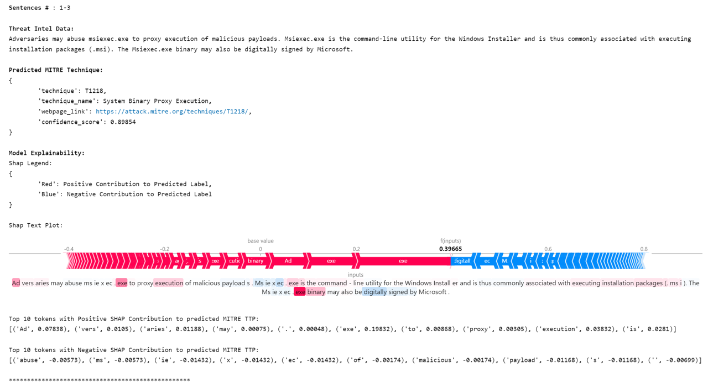
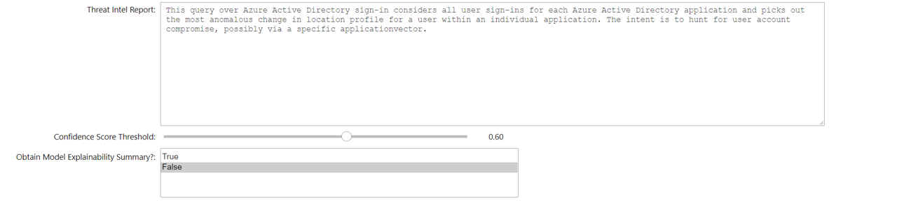
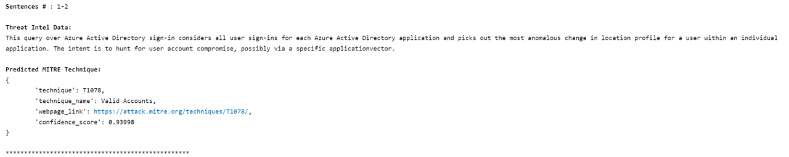

# MitreMap - Inferring MITRE Technique from Threat Intel Data

## Table of Contents
1. [Motivation](#motivation)
2. [MITRE ATT&CK Framework](#mitre-attck-framework)
3. [Goals of the MitreMap Notebook](#goals-of-the-mitremap-notebook)
4. [One-Time Setup](#one-time-setup)
    - [1. Creating a virtual environment](#1-creating-a-virtual-environment)
    - [2. Downloading model artifacts](#2-downloading-model-artifacts)
5. [Input Parameters](#input-parameters)
6. [Demo](#demo)
    - [1. MITRE Technique Inference for Threat Intel Data, WITH Model Explainability](#1-mitre-technique-inference-for-threat-intel-data-with-model-explainability)
    - [2. MITRE Technique Inference for Threat Intel Data, WITHOUT Model Explainability](#2-mitre-technique-inference-for-threat-intel-data-without-model-explainability)
7. [Additional Resources](#additional-resources)
<br><br>

## Motivation

**Cyber Threat Intelligence** (CTI) provides a framework for threat analysts to document the operations of a threat actor group, and record the findings of their investigations of specific cyber attack incidents.

With the increasing number and sophistication of attacks occuring across organization's workspace, CTI allows organisations to:
- Develop a more robust and proactive security posture 
- Better detect threat vulnerabilities in their infrastructre 
- Adopt security solutions and policies that allow them to better protect their environment. 

For example **Indicators of Compromise (IoC)** represent network artifacts of a cyber intrusion and are widely used in intrusion detection systems and antivirus softwares to detect future attacks.

**Threat Intel Data** is another form of CTI which comprises of unstructured text data, describing the tools, techniques and procedures (TTPs) used by threat actor groups in a cyber operation. Historically TI data is made available to the security community in the form of *blog posts reports* and *white papers*. 

With the increasing numebr of cyber attacks, it is not scalable to manually process this growing corpus of TI data to understand the motivations capabilities and TTPs associated with an actor group. Additionally TI data does not facilitate easy extraction of IoCs which, if documented in the report, can result in the loss of known indicators in the threat intelligence corpus. 

This opens up several avenues for **Machine Learning**, more particularly **Natural Language Processing** (NLP), to identify TTPs and extract IoCs from this data.
<br><br>

## MITRE ATT&CK Framework

The **MITRE ATT&CK** framework is an openly-sourced knowledge base of TTPs used by adversaries across enterprise and mobile applications. MITRE TTPs allow people and organizations to proactively identify vulnerabilites in their system based on the behaviors, methods and patterns of activity used by an actor group in different stages of a cyber operation. More information about the kinds of tactics and techniques used by threat actors can be found [here](https://attack.mitre.org/techniques/enterprise/).

<br>

<br><br>

## Goals of the MitreMap Notebook

In this notebook we use NLP to
1. Detect *MITRE Enterprise Techniques* using the **Distil-GPT2** transformer model, &
2. Extract *IoCs* using the ```iocextract``` package, and ```msticpy```'s IoC Extractor.

from unstructured English text-based Threat Intel data. We also provide some explainability into the TTP predictions made by our NLP model by identifying specific words or phrases in the input TI data that contribute to the prediction, using [SHAP](https://arxiv.org/pdf/1705.07874.pdf) values.
<br><br>

## One-Time Setup
<br>

### 1. Creating a virtual environment

Please configure a virtual environment, and download the ```../mitremap-notebook/requirements.txt``` packages in your venv -

``` 
    > cd Azure-Sentinel-Notebooks
    > pip install virtualenv
    > virtualenv <VENV_NAME>
    > source <VENV_NAME>\Scripts\activate
    > cd mitremap-notebook
    > pip install -r requirements.txt
```

__Key packages downloaded include:__ 
- ipywidgets==7.5.1
- transformers==4.5.1
- torch==1.10.2
- msticpy==2.1.2
- nltk==3.6.2
- iocextract==1.13.1
- shap==0.41.0
<br><br>

### 2. Downloading model artifacts

Estimated Time: < 10 minutes

- [**Distil-GPT2**](https://huggingface.co/distilgpt2) is an English-language model, pre-trained with the smallest GPT-2 Model, and was developed using knowledge-distillation, to serve as a faster, light-weight version of GPT-2. 

- We train a Distil-GPT2 model on publicly available Threat Intel data that has been mapped to Enterprise Techniques by security experts. We have scraped data from TRAM, Sentinel Hunting and Detection Queries, Sigma, CTID, and MITRE Repositories to create our training dataset, comprising of 13k entries. The model has been trained on all 191 MITRE Enterprise techniques, but the number of entries per technique used for training varies.

- In order to download the model artifacts, you will need ```bash``` configured in your notebook environment. The bash script will download the trained ```distilgpt2-512``` model artifacts from [MSTICPy's Data Repository](https://github.com/microsoft/msticpy-data/tree/mitre-inference/mitre-inference-models) to the local path ```../mitremap-notebook/distilgpt2-512/*```. <br>

- **Alternatively**, you can use GitHub to download the model artifacts to the above local path. 

- The model artifacts stored locally will comprise of:<br>

    - ```../mitremap-notebook/distilgpt2-512/model_state_dicts``` - Model weights associated with the trained Distil-GPT2 Model.
    - ```../mitremap-notebook/distilgpt2-512/labels``` - Mapping of prediction labels to MITRE Enterprise Techniques.
    - ```../mitremap-notebook/distilgpt2-512/tokenizer``` - Trained Distil-GPT2 tokenizer associated with the model. <br>
<br>

- If you have access to a GPU, we HIGHLY recommend using a GPU in the inference environment. The notebook will detect the device that is used to run the notebook, and configure the model to run on that device.

The following BASH script can be used to download the model artifacts in the notebook - ```! bash ./model.sh distilgpt2-512```

<br><br>

## Input Parameters

**IMPORTANT** In order to view the widgets in your Notebook, consider downloading the following jupyter extension via Terminal - ```jupyter labextension install @jupyter-widgets/jupyterlab-manager``` <br>

The notebook requires the following parameters from the user:

1. ***Threat Intel Data***: -
- Unstructured, English threat report that the user would like to process through the NLP model.
- The notebook will chunk the threat intel report into batches of 3 sentences, and apply the model on each batch to get the corresponding MITRE Enterprise Technique, to prevent any loss of information.

- Sample reports:

    ```    
    # 1
    Adversaries may abuse msiexec.exe to proxy execution of malicious payloads. Msiexec.exe is the command-line utility for the Windows Installer and is thus commonly associated with executing installation packages (.msi). The Msiexec.exe binary may also be digitally signed by Microsoft.
    ```

    ```
    # 2
    This query over Azure Active Directory sign-in considers all user sign-ins for each Azure Active Directory application and picks out the most anomalous change in location profile for a user within an individual application. The intent is to hunt for user account compromise, possibly via a specific applicationvector.
    ```

    ```
    # 3
    Threat actors can use auditpol binary to change audit policy configuration to impair detection capability. This can be carried out by selectively disabling/removing certain audit policies as well as restoring a custom policy owned by the threat actor.
    ```

    ```
    # 4
    When the trojan starts up it will attempt to install a scheduled task with the name of “Java Maintenance64” to keep itself running.
    ```

    ```
    # 5
    Detects exploitation attempt against Citrix Netscaler, Application Delivery Controller (ADS) and Citrix Gateway exploiting vulnerabilities reported as CVE-2020-8193 and CVE-2020-8195
    ```

2. ***Confidence Score Threshold***: 
- The TTP predictions for a sample TI input data have an associated confidence score from the NLP model, ranging from 0 (not very confident) to 1 (most confident). 
- Filter the results to predictions with confidence >= threshold configured by the user. <br>

- Default threshold: **0.6** <br> <br>

3. ***Obtain Model Explainability***: 
- Obtain further insights into which words and phrases in your input data contributed to the TTP prediction, using [SHAP](https://arxiv.org/pdf/1705.07874.pdf) values. 
- **Note**: Model Explainability will increase the time taken to obtain the inference results for your notebook! <br>

- Default value: **True** 
<br><br>

## Demo

Setting ***Obtain Model Explainability*** to **True** will increase the time taken to obtain insights for your notebook! If you are only interested in obtaining the TTP predictions for your Threat Intel data, consider setting ***Obtain Model Explainability*** to **False**.

<br>

Time to run the inference function will depend on the -

1. Length of the Threat Intel Report, and
2. If **Obtain Model Explainability** is set to True or False.

For our example threat reports above, time estimates are as follows -

- < 1 minute without model explainability, and 
- 1-2 minutes with model explainability.

<br><br>

### 1. MITRE Technique Inference for Threat Intel Data, WITH Model Explainability <br><br>

Input Data Configuration:

<br>

Output:

<br>

### 2. MITRE Technique Inference for Threat Intel Data, WITHOUT Model Explainability <br><br>

Input Data Configuration:

<br>

Output:

<br>

## Additional Resources